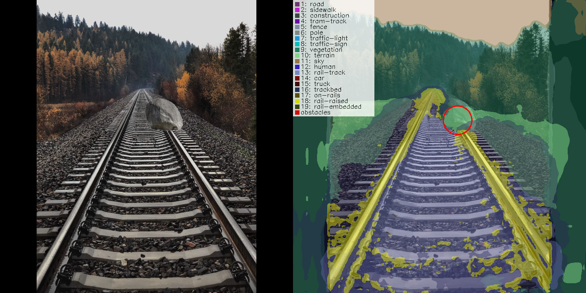

# RailSem-19 segmentation testing project

This is an experimental project aimed to build railway segmentation model using [RailSem19](https://www.wilddash.cc/railsem19) dataset.

It's built upon PyTorch [segmentation_models_pytorch](https://github.com/qubvel/segmentation_models.pytorch) package,
DeepLabV3Plus model is currently been used.

Basically, it's just few short scripts to train this model and examine how it works, but it may be usefull as a start
for more advanced projects.

Here is how video processing looks like:


UPD: Added experimental feature to detect railway obstacles 
(with single obstacle class and on the still images only, -x command-line option):



## Requirements

Linux (Ubuntu 22 or whatever), NVIDIA CUDA 11.x.

If there are other CUDA versions installed, check for compatible PyTorch version and correct `requirements.txt`.

I didn't test it on Windows, but I suppose it should work as is.

## Installation

Using venv and pip:

```bash
python3 -m venv .venv
source .venv/bin/activate
pip install -r requirements.txt
```

## Usage

To train the model use `train.py` script (see `train.py --help` for help on command-line switches).
Trained model weights are saved into `./weights` directory.

To view model results, use `test.py` script either with images (`-i` switch) or videos (`-v` switch).
Again, see `test.py --help` for help on command-line switches.